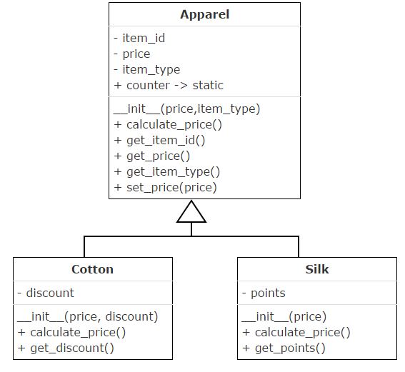

# 1. An apparel shop wants to manage the items which it sells.Write a python program to implement the class diagram given below.

# Class Description:

## Apparel class:

Initialize static variable counter to 100

In the constructor, auto-generate item_id starting from 101 prefixed by "C" for cotton apparels and "S" for silk apparels. Example – C101, S102, S103, 104 etc

calculate_price(): Add 5% service tax on the price of the apparel and update attribute, price with the new value

## Cotton class:

While invoking parent constructor from child constructor, pass "Cotton" as item_type

calculate_price(): Update attribute, price of Apparel class based on rules given below

Add service tax on price by invoking appropriate method of Apparel class

Apply discount on price

Add 5% VAT on final price

## Silk class:

While invoking parent constructor from child constructor, pass "Silk" as item_type

calculate_price(): Update attribute, price of Apparel class based on rules given below

Add service tax on price by invoking appropriate method of Apparel class

Identify points earned based on rules given below:

Silk apparels with price more than Rs. 10000, earn 10 points and anything less than or equal to that earn 3 points

Initialize attribute, points with the identified points

Add 10% VAT on price

# Note: Perform case sensitive string comparison
